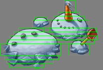
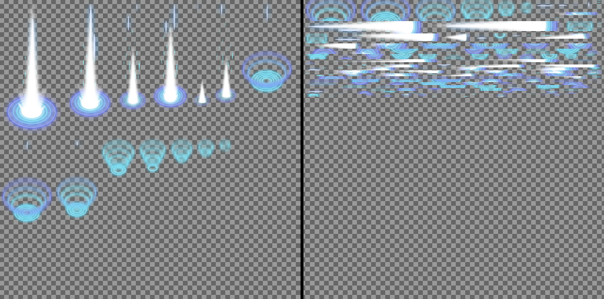

     
    Open Source Library

# What is this?
This is a collection of tools we use on a daily basis in our projects. They
are essential for our game development pipeline. We are releasing them open
source in spirit of cooperation and sharing. If you are a game developer, then
we hope you will find them useful and that we can benefit from any
improvements you'll make to them.

# Why would I want to use it?
Our code is fast, reliable, CLI-friendly and, most of all, proven in production code used by
millions of users on a multitude of devices. It gets the job done.

# Can I use the code?
Yes. You can incorporate our tools into your projects, be them open source or
commercial. We only require that any improvements, bug fixes, new features are
made available to general public, in the same way we're sharing the code with
you. We're happy to accept pull requests.

You can find the binding agreement in LICENSE.txt (MPL 2.0).

# How can I use the code?
Our initial release focuses on the graphic assets processing pipeline. We are
providing the following tools:

## surfsplit
 
Example surfsplit results

We begin by scanning source image files for non-transparent areas. Regions
containing data are saved in an external metafile, which allows omitting
transparent parts of the image during rendering.

Detailed description of how to render split regions is available at docs/surfsplit.txt.

To enable split visualization (-v) build surfsplit with BUILD_VIS flag. This
will add OpenGL and SDL2 dependencies.

## textureatlas
 
Example texture atlas (without and with surfsplit)

Source image files are combined into one big texture, called an atlas, in
order to reduce number of graphic context switches. We use surfsplit output to
achieve high density of usable data. Since input images are split into
relatively small rectangles, we're also able to obtain much more optimal
packing of content.

## rgbasplit
There are two major texture compression standards on mobile platforms: PVR and
ETC. ETC1 doesn't support alpha channel and PVR quality is greatly degraded if
alpha channel is used. In order to achieve transparent textures it is common
to use two input textures for in-game images, one with RGB data, and another
with alpha channel. Popular compression utilities are not able to perform this
channel split, so we needed a tool that will do it.

Currently we are using rgbasplit only for PVR compression, as the ETC images
can be split during compression in etcpak utility (https://github.com/wolfpld/etcpak).

## mipsplit
To achieve texture streaming, we need to split texture mip-maps into separate
files. This utility does exactly that, with support for PNG, PVR and ETC
payloads.

# Are there any caveats?
Kinda. Currently we only provide data processing tools. You'll have to write
loading code yourself. Proper rendering of surfsplit-processed images is also
a bit nuanced. We hope we will be able to provide example loader code in the
future.

# Build instructions
For each tool listed, there are provided Visual Studio project files, as well as the Makefiles, in their respective folders.

All tools have been tested to build and work on Windows, Linux and OSX.
